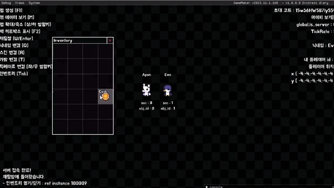

#

## Project Distress Diary (Remaking)

2022년에 개발 중이던 오리지널 프로젝트는 아래에서 볼 수 있음

<a href = "https://github.com/ABER1047/Distress_diary_multiplayer"> Original Project </a>

  

##

### 2024-01-22

#### Remaking randomized map algorithm
#### 랜덤 맵 생성 알고리즘 리메이크

|Old 기존|New 리메이크|
|---|---|
|</img>||

기존엔 한쪽 방향으로만 뻗어나가는 형태를 띄고 있는 문제가 있어

완전히 새롭게 알고리즘을 구성했음

리메이크된게 최적화할려고 맵 배열 사이즈에 제한을 걸어뒀는데

이것때문에 아주 가끔 맵 생성 시간이 오래걸리는 단점이 있음 (길면 1~2초 차이)

##

### 2024-01-26

#### Online Multiplayer basic foundation code made (Tickrate, Player movement...)
#### 온라인 플레이 기초 토대 코드 작성 (틱레이트, 플레이어 이동...)

|Tickrate Testing 틱레이트 테스트|
|---|
|</img>|

##

### 2024-01-30

#### Multi-cell inventory system added
#### 멀티셀 인벤토리 시스템 추가

|Multi-cell inventory testing 멀티셀 인벤토리 테스트|
|---|
|</img>|

##

### 2024-02-09 ~ 2024-02-18

#### New inventory system(Rotating/Stacking/Various size of items...etc) And lootable objects added

#### 새로운 인벤토리 관련 시스템(아이템 회전/겹치기/여러 크기의 아이템 등등...) 및 루팅 가능한 오브젝트들 추가

||
|---|
|</img>|

